# Instructions

## Quick Navigation

- **[Setup & Configuration](#setup--configuration)** - Initial setup and configuration steps
- **[Jailbreaking & WiFi Setup (Breaking Cloud Dependency)](#jailbreaking--wifi-setup-breaking-cloud-dependency)** - Flash custom firmware and break cloud dependency

## Setup & Control Flow

```mermaid
graph TD
    subgraph "Phase 1: One-Time Setup (Do this once per bulb)"
        A[/"👤 1. Start your MQTT Broker"/] --> B["👤 2. Factory Reset Bulb<br>(Flick power switch rapidly 5+ times)"];
        B --> C["👤 3. Run the Wi-Fi Setup Command<br><code>python sengled_tool.py --setup-wifi</code>"];
        
        C -- "This automatically starts a..." --> D{{"💻 Temporary Web Server<br><i>(Mimics Sengled's online server)</i>"}};
        
        E["💡 Bulb (in setup mode)"] -- "Connects to your PC, expecting<br>to find Sengled's cloud server" --> D;
        D -- "Tells the bulb to use your<br>local MQTT Broker instead" --> E;
        
        E -- "Connects to your Wi-Fi,<br>then your local Broker!" --> F[("📡 Your MQTT Broker")];
        F --> G["✅ Setup Complete! The bulb is now on your local network."];
    end

    subgraph "Phase 2: Everyday Control (Use these commands anytime)"
        G --> H{"Choose your control method"};
        
        H -- "Control via Broker (MQTT)" --> I["⌨️ 👤 Send command via Broker<br><code>--mac ... --on</code>"];
        I -- "Command goes to Broker" --> J[("📡 Your MQTT Broker")];
        J -- "Broker relays command to bulb" --> K((💡 Bulb Receives Command & Responds));

        H -- "Direct Control (UDP)" --> M["⌨️ 👤 Send command directly<br><code>--ip ... --udp-on</code>"];
        M -- "Command goes straight<br>to the bulb over Wi-Fi" --> K;
    end

    %% --- STYLES ---
    style A fill:#e8f5e9,stroke:#388e3c,stroke-width:2px
    style B fill:#e8f5e9,stroke:#388e3c,stroke-width:2px
    style C fill:#e8f5e9,stroke:#388e3c,stroke-width:2px
    style I fill:#e8f5e9,stroke:#388e3c,stroke-width:2px
    style M fill:#e8f5e9,stroke:#388e3c,stroke-width:2px
    
    style D fill:#e1f5fe,stroke:#0288d1,stroke-width:2px

    style E fill:#fff9c4,stroke:#fbc02d,stroke-width:2px
    style K fill:#fff9c4,stroke:#fbc02d,stroke-width:2px

    style F fill:#fce4ec,stroke:#c2185b,stroke-width:2px
    style J fill:#fce4ec,stroke:#c2185b,stroke-width:2px

    style G fill:#d1c4e9,stroke:#512da8,stroke-width:2px
```


## Setup & Configuration

### Prerequisites

* Install Python 3.10+ and dependencies:

```bash
pip install -r requirements.txt
```

* Install an MQTT broker ([Mosquitto download link](https://mosquitto.org/download/)) reachable from the bulb.
* Connect your computer to the bulb AP `Sengled_Wi‑Fi Bulb_XXXXXX` before pairing.

### Broker Setup (TLS Required)

The bulb requires an MQTT broker that accepts TLS connections.

#### Example Broker: Mosquitto

1. Download and install Mosquitto from the [official site](https://mosquitto.org/download/).
2. Install OpenSSL ([Windows builds here](https://slproweb.com/products/Win32OpenSSL.html)).
3. Generate a self‑signed TLS certificate:
    
    <details>
    
    <summary>Windows</summary>
    
    ```bash
    # Create a local CA
    "C:\Program Files\OpenSSL-Win64\bin\openssl.exe" genrsa -out ca.key 2048
    "C:\Program Files\OpenSSL-Win64\bin\openssl.exe" req -x509 -new -key ca.key -days 3650 -out ca.crt -subj "/CN=Local-CA"
    
    # Create server key + CSR (use any descriptive CN, e.g., broker.local)
    "C:\Program Files\OpenSSL-Win64\bin\openssl.exe" genrsa -out server.key 2048
    "C:\Program Files\OpenSSL-Win64\bin\openssl.exe" req -new -key server.key -out server.csr -subj "/CN=broker.local"
    
    # Sign server cert
    "C:\Program Files\OpenSSL-Win64\bin\openssl.exe" x509 -req -in server.csr -CA ca.crt -CAkey ca.key -CAcreateserial -out server.crt -days 3650 -sha256
    ```
    
    </details>
    
    <details>
    
    <summary>Linux/MacOS</summary>
    
    ```bash
    # Create a local CA
    openssl genrsa -out ca.key 2048
    openssl req -x509 -new -key ca.key -days 3650 -out ca.crt -subj "/CN=Local-CA"
    
    # Create server key + CSR (use any descriptive CN, e.g., broker.local)
    openssl genrsa -out server.key 2048
    openssl req -new -key server.key -out server.csr -subj "/CN=broker.local"
    
    # Sign server cert
    openssl x509 -req -in server.csr -CA ca.crt -CAkey ca.key -CAcreateserial -out server.crt -days 3650 -sha256
    ```
    
    </details>

4. Place your generated certificate and key files (`ca.crt`, `server.crt`, `server.key`) in the project root directory alongside the `mosquitto.conf` file, adjusting file names if you used different names during certificate generation.

5. Start Mosquitto with the bundled config:
    
      <details>
    
      <summary>Windows (PowerShell)</summary>
    
      Run the terminal as Administrator and ideally `cd` to the project root first:
    
      ```bash
      "C:\Program Files\mosquitto\mosquitto.exe" -c .\mosquitto.conf -v
      ```
    
      </details>
    
      <details>
    
      <summary>Linux/macOS</summary>
    
      ```bash
      mosquitto -c ./mosquitto.conf -v
      ```
    
      </details>

### Wi‑Fi Pairing (Quick)

* **Interactive Mode:**
  In interactive mode, the bulb will return a list of surrounding Wi‑Fi networks (SSIDs) it detects. The script will prompt you to choose which network it should connect to, and you will need to provide the corresponding Wi‑Fi password.
  
  **Note:** Replace `192.168.0.100` in the examples with the local IP address of the device running the broker (most likely your PC).

```bash
# If --broker-ip is omitted, the tool uses this PC's local IP automatically
python sengled_tool.py --setup-wifi
```

* **Non‑interactive Mode:**

```bash
# If --broker-ip is omitted, the tool uses this PC's local IP automatically
python sengled_tool.py --setup-wifi --ssid "YourSSID" --password "YourWifiPassword"
```

The tool starts an embedded HTTP server, waits for the bulb to call `/life2/device/accessCloud.json` and `/jbalancer/new/bimqtt`, then (if it detects the bulb's LAN IP) attempts a UDP ON/OFF test and prints follow‑up command examples.

If ports 80/8080 are busy, the tool assumes you run your own HTTP server and will not wait for endpoint hits or run the UDP test.

## Basic Control

<details>
<summary><strong>MQTT Control</strong> - [MQTT_COMMANDS_REFERENCE.md](references/MQTT_COMMANDS_REFERENCE.md)</summary>

```bash
python sengled_tool.py --broker-ip 192.168.0.100 --mac E8:DB:8A:AA:BB:CC --on
python sengled_tool.py --broker-ip 192.168.0.100 --mac E8:DB:8A:AA:BB:CC --off
python sengled_tool.py --broker-ip 192.168.0.100 --mac E8:DB:8A:AA:BB:CC --brightness 50
python sengled_tool.py --broker-ip 192.168.0.100 --mac E8:DB:8A:AA:BB:CC --color 255 0 0
python sengled_tool.py --broker-ip 192.168.0.100 --mac E8:DB:8A:AA:BB:CC --color-temp 65
```

</details>

<details>
<summary><strong>UDP Control</strong> - [UDP_COMMANDS_REFERENCE.md](references/UDP_COMMANDS_REFERENCE.md)</summary>

```bash
python sengled_tool.py --ip 192.168.0.247 --udp-on
python sengled_tool.py --ip 192.168.0.247 --udp-off
python sengled_tool.py --ip 192.168.0.247 --udp-brightness 50
```

</details>

## Troubleshooting

<details>
<summary><strong>TLS Required</strong></summary>

The bulb requires an MQTT broker that accepts TLS connections. Use self‑signed certificates if necessary (see [Broker Setup](#broker-setup-tls-required) above for certificate generation instructions).

</details>

<details>
<summary><strong>Unresponsive Bulbs</strong></summary>

This commonly happens after a power loss when the bulb needs to re‑query the HTTP endpoints to get MQTT broker settings.

1) Start the local HTTP setup server so the bulb can fetch MQTT settings (use `--broker-ip` to force a specific broker IP — most likely your PC or wherever your broker is running; on Windows run terminal as Administrator):

```bash
python sengled_local_server.py
```

2) Power‑cycle the bulb (turn off and on)

3) Watch the server logs for a hit to `/jbalancer/new/bimqtt` returning `host: <broker-ip>, port: 1883`

4) Once seen, both UDP and MQTT control should resume

If still stuck:

- Factory reset options:
  - Hardware: rapidly toggle power 5 times until the bulb flashes and broadcasts `Sengled_Wi‑Fi Bulb_XXXXXX`.
  - Software: if the bulb is online on your broker (if only UDP doesn't work), you can send a reset:

```bash
python sengled_tool.py --broker-ip 192.168.0.100 --mac E8:DB:8A:AA:BB:CC --reset
```

- Ensure broker is running (Windows example — run terminal as Administrator and ideally `cd` to the project root first):

```bash
"C:\Program Files\mosquitto\mosquitto.exe" -c .\mosquitto.conf -v
```

**Note:** The server defaults to your PC's local IP; use `--broker-ip` if your broker is on another device or for troubleshooting.

</details>

## Jailbreaking & WiFi Setup (Breaking Cloud Dependency)

It is now possible to reflash Sengled bulbs (at least the W31-N15 and W31-N11 have been tested, which use the Sengled WF863 module, itself containing an ESP8266EX chip) with open firmware such as [Tasmota](https://tasmota.github.io/) (tested) and ESPHome (untested). The process to download an arbitrary firmware involves using a "shim" app known as Sengled-Rescue, which is located in the `sengled-ota` folder of the project. A compiled version of Sengled-Rescue is located in `shim.bin` of the main project.

Once you set up the workflow for one bulb, flashing additional bulbs should become a 5-minute job.

To flash firmware, you first need to reach "Phase 2" in MQTT mode above (follow guide below). **You need to be able to send MQTT commands through your broker using sengled_tool.py**. Once you are able to send on/off commands, you can send the `--upgrade shim.bin` command to reflash Sengled-Rescue and begin that workflow.

```bash
python sengled_tool.py --broker-ip 192.168.0.100 --mac E8:DB:8A:AA:BB:CC --upgrade "shim.bin"
[        ^-- This part comes from your successful WiFi setup -- ^      ] [^- Upgrade command]
```

Once you have flashed shim.bin successfully, you will see a "Sengled-Rescue" WiFi SSID on your network. Connect to it and open http://192.168.4.1 in your browser. From there, you will see whether it landed in "ota_0" (bad, cannot flash) or "ota_1" (good, can flash up to 1MB). Though the Flash chip in the bulb (WF863 module) is 2MB, the firmware you upload cannot "clobber" the running software (in ota_1) which begins a bit past 1MB - thus the size limitation. Uploading a firmware *.bin to "boot" completely transforms the software of the bulb, making it a basic/generic ESP8266 device.

After you've flashed your software, the bulb is now a standard ESP8266EX device, for all intents and purposes.

### Tasmota Templates

When flashing Tasmota firmware to your Sengled bulbs, use these device templates:

#### W31-N15 (RGBW Bulb)
```json
{"NAME":"Sengled RGBW","GPIO":[0,0,0,0,0,0,0,0,417,416,419,418,0,0],"FLAG":0,"BASE":18}
```

**Reference:** [Sengled W31-N15 Template](https://templates.blakadder.com/sengled_W31-N15.html)

#### W31-N11 (White Bulb)  
```json
{"NAME":"Sengled W31-N11","GPIO":[0,0,0,0,416,0,0,0,0,0,0,0,0,0],"FLAG":0,"BASE":18}
```

These templates configure the correct GPIO pins for PWM control of the LED channels.
