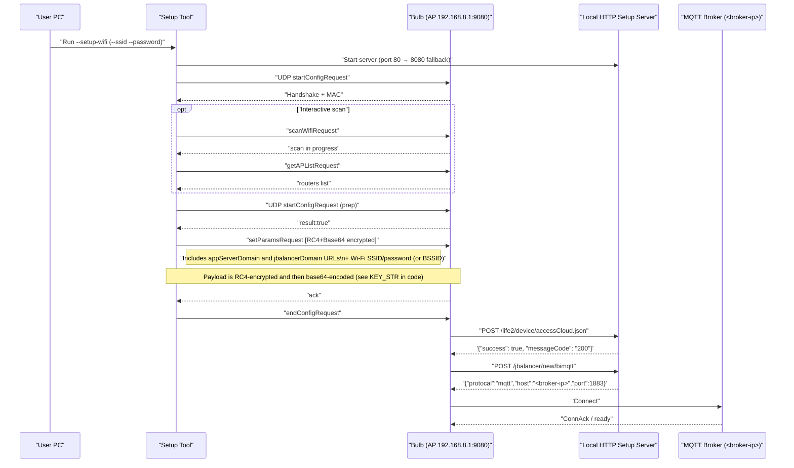

# Sengled WiFi Bulb Local Control / Setup Tool

A small reverse‑engineering and local‑control toolkit for Sengled Wi‑Fi bulbs. It pairs bulbs to your own MQTT broker (no cloud), provides UDP control, and includes an optional (untested) firmware‑upgrade publish.

A comprehensive tool for local control and protocol research of Sengled Wi‑Fi bulbs. It can pair bulbs to your own MQTT broker (no cloud), provides UDP control, and optionally publishes a firmware URL for advanced users (e.g., Tasmota/ESPHome) for testing on your own devices.

## Quick usage (current flow)

For a fuller, step‑by‑step guide, see [Instructions](INSTRUCTIONS.md).

The tool can perform Wi‑Fi pairing and basic UDP control. The HTTP server used during pairing is now embedded and auto‑managed by the tool.

### Install

* Python 3.10+ recommended
* Install dependencies:

```
pip install -r requirements.txt
```

### Wi‑Fi pairing steps

1. Start your MQTT broker (e.g., Mosquitto). See more information and examples in [INSTRUCTIONS.md](INSTRUCTIONS.md).

   * Windows example (run terminal as Administrator and ideally `cd` to the project root first):

     ```
      "C:\\Program Files\\mosquitto\\mosquitto.exe" -c .\\mosquitto.conf -v
     ```
2. Factory reset the bulb to enter AP mode.

   * Rapidly toggle power 5 times until it broadcasts `Sengled_Wi‑Fi_Bulb_...`.
3. Run the Wi‑Fi setup:

   * Interactive:

     ```
      # If --broker-ip is omitted, the tool uses this PC's local IP automatically
      python sengled_tool.py --setup-wifi
     ```
     Connect your computer to the bulb’s AP: `Sengled_Wi‑Fi_Bulb_...` when prompted
   * Non‑interactive:

     Connect your computer to the bulb’s AP: `Sengled_Wi‑Fi_Bulb_...` first.
     ```
      # If --broker-ip is omitted, the tool uses this PC's local IP automatically
      python sengled_tool.py --setup-wifi --ssid "YourSSID" --password "YourWifiPassword"
     ```
4. If the embedded HTTP server can’t bind to 80/8080, stop whatever is on those ports or set `SENGLED_HTTP_PORT`.
5. The bulb will hit:

   * `POST/GET /life2/device/accessCloud.json`
   * `POST/GET /jbalancer/new/bimqtt`
     Then it connects to your MQTT broker.

What happens:

* The tool starts a local HTTP server automatically on port 80 (falls back to 8080 if needed; override with env `SENGLED_HTTP_PORT`).
* It performs the Wi‑Fi setup handshake with the bulb and sends config that points to your MQTT broker.
* It waits until the bulb hits both endpoints, then shuts down the HTTP server automatically:

  * `POST/GET /life2/device/accessCloud.json` (returns success JSON)
  * `POST/GET /jbalancer/new/bimqtt` (returns `{ protocal: "mqtt", host: <broker-ip>, port: 1883 }`)
* After that, it blinks the bulb via UDP (ON → 3s → OFF) as a quick success indicator.

### MQTT control (via broker) - [MQTT_COMMANDS_REFERENCE.md](MQTT_COMMANDS_REFERENCE.md)

Use these after the bulb is paired and connected to your broker.

```
# Turn on
python sengled_tool.py --broker-ip 192.168.0.100 --mac E8:DB:8A:AA:BB:CC --on

# Turn off
python sengled_tool.py --broker-ip 192.168.0.100 --mac E8:DB:8A:AA:BB:CC --off

# Set brightness (0-100)
python sengled_tool.py --broker-ip 192.168.0.100 --mac E8:DB:8A:AA:BB:CC --brightness 50

# Set color (R G B; 0-255 each)
python sengled_tool.py --broker-ip 192.168.0.100 --mac E8:DB:8A:AA:BB:CC --color 255 0 0

# Set color temperature (0-100% as 2700-6500K)
# Note: When changing color temperature, include a switch ON in the same payload (the app does this automatically).
python sengled_tool.py --broker-ip 192.168.0.100 --mac E8:DB:8A:AA:BB:CC --color-temp 65

# Query status
python sengled_tool.py --broker-ip 192.168.0.100 --mac E8:DB:8A:AA:BB:CC --status

# Factory reset
python sengled_tool.py --mac E8:DB:8A:AA:BB:CC --reset

# Custom payload (JSON array of command objects)
# Example: turn on via raw publish
python sengled_tool.py --broker-ip 192.168.0.100 --mac E8:DB:8A:AA:BB:CC \
  --custom-payload "[{\"dn\":\"E8:DB:8A:AA:BB:CC\",\"type\":\"switch\",\"value\":\"1\",\"time\":1690000000000}]"

# Custom publish (raw topic/payload)
python sengled_tool.py --broker-ip 192.168.0.100 --mac E8:DB:8A:AA:BB:CC \
  --topic wifielement/E8:DB:8A:AA:BB:CC/update \
  --payload "[{\"dn\":\"E8:DB:8A:AA:BB:CC\",\"type\":\"switch\",\"value\":\"1\",\"time\":1690000000000}]"

# Firmware upgrade (Sengled-Rescue path, flashes shim to let you run your own firmware)
# ⚠️ This is a one-way trip! The *.bin you flash *MUST* be compatible with ESP RTOS SDK bootloader, launching from an OTA
# partition (unpredictably either ota_0 or ota_1, so you don't know where it will land at the time of update).
# See sengled_ota/README.md for details.
# A working shim.bin is included - a compiled copy of Sengled-Rescue - that lets you flash any firmware.
python sengled_tool.py --broker-ip 192.168.0.100 --mac E8:DB:8A:AA:BB:CC \
  --upgrade shim.bin

# Group control (example: switch ON for a list of MACs)
python sengled_tool.py --broker-ip 192.168.0.100 \
  --group-macs E8:DB:8A:AA:BB:CC E8:DB:8A:11:22:33 \
  --group-switch on
```

### UDP control (direct local commands)

```
# Replace <bulb-ip> with the bulb's IP

# Turn on
python sengled_tool.py --ip <bulb-ip> --udp-on

# Turn off
python sengled_tool.py --ip <bulb-ip> --udp-off

# Set brightness (0-100)
python sengled_tool.py --ip <bulb-ip> --udp-brightness 50

# Set color (R G B; 0-255 each)
python sengled_tool.py --ip <bulb-ip> --udp-color 255 0 0
```

**Note:** There might be more UDP commands available. Check [UDP_COMMANDS_REFERENCE.md](UDP_COMMANDS_REFERENCE.md) for the complete list of documented commands.

UDP control does not require the MQTT broker or HTTP setup server once the bulb is paired and on your LAN.

Power loss behavior:

- After a power cycle, some bulbs re‑query the HTTP endpoints (`/life2/device/accessCloud.json` and `/jbalancer/new/bimqtt`) to fetch MQTT settings before connecting. Make sure your MQTT broker is running. If the bulb doesn’t reconnect, start the local HTTP setup server once:
  ```
  python fake_sengled_server.py
  ```
  **Note:** The server defaults to your PC's local IP; use `--broker-ip` if your broker is on another device or for troubleshooting.
  This binds to port 80 (falls back to 8080). If you use a non‑default port, ensure pairing pointed the bulb to that port.

### Troubleshooting quick actions

- Start the local HTTP setup server so the bulb can fetch MQTT settings (use `--broker-ip` to force a specific broker IP — most likely your PC or wherever your broker is running; on Windows run terminal as Administrator):
  ```
  python fake_sengled_server.py
  ```
  **Note:** The server defaults to your PC's local IP; use `--broker-ip` if your broker is on another device or for troubleshooting.

- Factory reset options:

  * Hardware: rapidly toggle power 5–10 times until the bulb flashes and broadcasts `Sengled_Wi‑Fi Bulb_XXXXXX`.
  * Software: if the bulb is online on your broker, you can send a reset:

    ```
    python sengled_tool.py --broker-ip 192.168.0.100 --mac E8:DB:8A:AA:BB:CC --reset
    ```
* Ensure broker is running (Windows example — run terminal as Administrator and ideally `cd` to the project root first):

  ```
  "C:\\Program Files\\mosquitto\\mosquitto.exe" -c .\\mosquitto.conf -v
  ```
 

---

### If UDP commands time out

- **Observed (not 100% confirmed)**: If the bulb can’t reach the local HTTP endpoints (`/life2/device/accessCloud.json` and `/jbalancer/new/bimqtt`) after power-up, it may ignore UDP. Some bulbs appear to re-query these endpoints on boot before enabling MQTT/UDP.
- **Try this**:
  1) Start your MQTT broker.
  2) Run the local HTTP server (it defaults to your PC's IP; use --broker-ip if your broker is on another device or for troubleshooting): `python fake_sengled_server.py`
  3) Power-cycle the bulb at the wall switch.
  4) Watch the server logs for a hit to `/jbalancer/new/bimqtt` returning `host: <broker-ip>, port: 1883`.
  5) Once seen, control via MQTT should resume. If the bulb stays flaky, send a reset via MQTT and redo Wi‑Fi pairing.

## FAQ

* How do I use this with Home Assistant?

  * This repo contains the protocol details (MQTT topics/payloads and UDP commands) that enable creating a Home Assistant integration. It does not include one.

* Will this make my bulbs work with Google Home?

  * If a bulb was already paired with Sengled cloud, it should continue to work with Google Home as before. You can still control it locally via UDP.
  * Bulbs newly paired with this tool are redirected to your local broker and do not register with Sengled cloud; they will not work with the official Sengled Google Home integration.

* I don’t use Home Assistant. Can I still control bulbs?

  * Yes, but you’ll need a custom solution unless someone publishes an integration. Options: a small Android app, a simple script/service on a PC or server triggered by your phone (shortcuts/webhooks), or any automation that publishes the documented MQTT or UDP commands.


### Wi‑Fi setup sequence (reverse‑engineered)

The following diagram shows the local AP-mode pairing flow: what the tool sends to the bulb, what the bulb fetches from your local HTTP server, and how it connects to your MQTT broker. This matches the actual behavior in `sengled_tool.py` and the documented endpoints.


