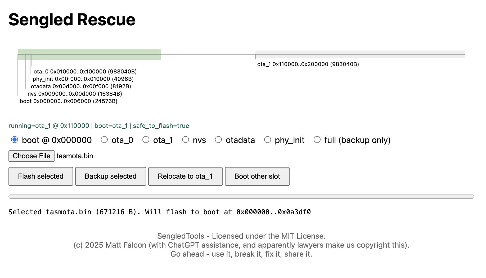

# Sengled WiFi Bulb Local Control / Setup Tool

A comprehensive tool for local control and protocol research of Sengled Wi‑Fi bulbs. It can pair bulbs to your own MQTT broker (no cloud), provides UDP control, and includes firmware flashing capability to install open source firmware like Tasmota since Sengled's cloud servers are no longer functional.

## Quick Navigation

- **[Quick Start: The Easy Setup Wizard](#quick-start-the-easy-setup-wizard)** - Zero-config wizard for beginners
- **[Factory Reset Procedures](docs/RESET_PROCEDURES.md)** - Visual reset steps for devices
- **[Flashing Information](#flashing-information)** - Flash Tasmota/ESPHome
- **[Command Reference](#command-reference)** - Complete CLI help and options
- **[FAQ](#faq)** - Frequently asked questions
- **[Wi-Fi Setup Sequence](#wi-fi-setup-sequence)** - Technical pairing details
- **[Advanced Instructions](docs/INSTRUCTIONS_ADVANCED.md)** - Detailed troubleshooting and advanced usage


## Quick Start: The Easy Setup Wizard

This is the new version. Use the zero‑config wizard. No external Mosquitto. No OpenSSL. Cross‑platform. The tool automatically generates TLS certificates and runs an embedded MQTT broker.

### Prerequisites

**Step 1:** Install Python 3.10 or newer from [https://www.python.org/downloads/](https://www.python.org/downloads/)

**Step 2:** Download this tool in your terminal/command prompt:
```bash
git clone https://github.com/HamzaETTH/SengledTools.git
```

**Step 3:** Navigate to the downloaded folder:
```bash
cd SengledTools
```

**Step 4:** Install Python dependencies:
```bash
pip install -r requirements.txt
```

**Step 5:** Power on bulb and connect your computer to the bulb AP `Sengled_Wi‑Fi Bulb_XXXXXX`

### Step-by-Step Setup

1) **Factory Reset the Bulb**: Flick the power switch rapidly 5+ times until the bulb flashes and broadcasts `Sengled_Wi‑Fi Bulb_XXXXXX`. See [Factory Reset Procedures](docs/RESET_PROCEDURES.md).

2) **Connect to Bulb's AP**: Join the `Sengled_Wi‑Fi Bulb_XXXXXX` network from your computer

3) **Run the Wizard**:

```bash
python sengled_tool.py
```

4) **Follow on‑screen prompts**. The wizard will:
   - Generate self‑signed TLS certificates automatically
   - Start an embedded MQTT broker (TLS on 8883)
   - Handle WiFi setup interactively OR use `--ssid` and `--password` for non-interactive setup
   - Pair the bulb to your local broker automatically
   - Detect bulb model and module type for compatibility checking
   - **Optionally offer firmware flashing** after successful setup (based on detected compatibility). Use `--force-flash` to bypass these checks if you're sure about compatibility.


## Flashing information

It is possible to reflash compatible Sengled bulbs (see compatibility list) with open-source firmware like [Tasmota](https://tasmota.github.io/) or ESPHome. This process permanently breaks the dependency on any cloud servers. The process to download an arbitrary firmware involves using a "shim" app known as Sengled-Rescue, which is located in the sengled-ota folder of the project. A compiled version of Sengled-Rescue is located in shim.bin of the main project.

Once you’ve completed Wi-Fi pairing and confirmed that sengled_tool.py can communicate with the bulb (sending basic on/off commands), the script will prompt you to flash the firmware.

It will basically run the --upgrade option to install Sengled-Rescue:
```
python sengled_tool.py --mac E8:DB:8A:AA:BB:CC --upgrade "shim.bin"
```

The script will print some scary warning messages to make sure you are prepared for the upgrade. At this time, download and unzip the [Tasmota OTA bin firmware](https://ota.tasmota.com/tasmota/release/) or compile one for ESPHome. For basic usage of the setup_tool script, proceed with the default firmware path. Once the bulb has accepted the shim, the script will finish, but **you're not done yet**.

Look for the Sengled-Rescue Wifi network and join it. Then navigate to http://192.168.4.1 in a browser. It will be slow, so be patient and refresh until it loads.



1. Optional, but recommended: make a full backup of the chip. Select full > backup selected.
2. Select boot > choose file (pick the Tasmota or ESPHome bin) > flash selected

The bulb will accept the update and reboot. It may flash different colors and will take a few minutes. For Tasmota, once an RGBW bulb has been setup, it will do a slow red blink to indicate it needs to be connected to Wifi. To do so, connect to the `tasmota_XXXXXX-####` Wifi network and visit http://192.168.4.1 to set up the credentials. Then you can control the device by visiting its IP address—found on the connection page or by checking which devices are connected to your router.

The **flashing/jailbreaking process** is based on testing with **W31-N15 and W31-N11** bulbs, which use Sengled's WF863 module (based on ESP8266EX). **Other bulbs appear to use other modules** (like WF864, based on MX1290 chip), which may not work with the flashing process. The basic MQTT/UDP control should work with most Sengled bulbs. We're working on acquiring other bulbs to test/develop with them and will add to this list.

### Currently Known Working Bulbs ✅

* **W31-N15** (WiFi multi-color LED) - WF863 Module / Espressif ESP8266EX chip
* **W31-N11** (WiFi multi-color LED) - WF863 Module

### Currently Known NON-Working Bulbs ❌

* **W12-N15** (WiFi white LED) - WF864 module / MXCHIP MX1290 chip
* **W21-N13** and **W11-N13** (WiFi multi-color LED) - MXCHIP EMW3091 module / unknown chip


> **Tip:** Check the side of your bulb for FCC ID - it contains the ID of the module (or chip) used inside the bulb, matching one of the above. Post an issue if you find a bulb using a supported module that's not listed!

---


### Tasmota Templates

When flashing Tasmota firmware to your Sengled bulbs, use these device templates by [importing in the web UI](https://tasmota.github.io/docs/Templates/#importing-templates):

#### W31-N15 (RGBW Bulb)

```json
{"NAME":"Sengled RGBW","GPIO":[0,0,0,0,0,0,0,0,417,416,419,418,0,0],"FLAG":0,"BASE":18}
```

**Reference:** [Sengled W31-N15 Template](https://templates.blakadder.com/sengled_W31-N15.html)

#### W31-N11 (White Bulb)

```json
{"NAME":"Sengled W31-N11","GPIO":[0,0,0,0,416,0,0,0,0,0,0,0,0,0],"FLAG":0,"BASE":18}
```

These templates configure the correct GPIO pins for PWM control of the LED channels.


### Tasmota PWM Cheatsheet

Quick PWM commands for brightness control in the Tasmota console (for Sengled W31-N11):

- **Off:** `PWM1 0`
- **25%:** `PWM1 256`
- **50%:** `PWM1 512`
- **100%:** `PWM1 1023`


## Command Reference

### Help Output

```bash
python sengled_tool.py --help
```

**Usage:** For simple usage, simply run the tool without arguments.
```
usage: sengled_tool.py [-h] [--setup-wifi] [--broker-ip BROKER_IP] [--broker-port BROKER_PORT]
                       [--ca-crt CA_CRT] [--server-crt SERVER_CRT] [--server-key SERVER_KEY] [--ssid SSID]
                       [--password PASSWORD] [--embedded] [--regen-certs] [--status] [--mac MAC] [--on]   
                       [--off] [--toggle] [--brightness BRIGHTNESS] [--color R G B]
                       [--color-temp COLOR_TEMP] [--reset] [--custom-payload CUSTOM_PAYLOAD]
                       [--upgrade UPGRADE] [--group-macs GROUP_MACS [GROUP_MACS ...]]
                       [--group-switch {on,off}] [--group-brightness GROUP_BRIGHTNESS]
                       [--group-color-temp GROUP_COLOR_TEMP] [--gradient-time GRADIENT_TIME]
                       [--effect-status EFFECT_STATUS] [--ip IP] [--udp-on] [--udp-off]
                       [--udp-brightness UDP_BRIGHTNESS] [--udp-color R G B] [--udp-json UDP_JSON]
                       [--topic TOPIC] [--payload PAYLOAD] [--force-flash] [--run-http-server]
                       [--run-servers] [--http-port HTTP_PORT] [--http-server-ip HTTP_SERVER_IP]
                       [--verbose]

Sengled Local Control Tool

options:
  -h, --help            show this help message and exit
  --setup-wifi          Start interactive Wi-Fi setup.
  --broker-ip BROKER_IP
                        IP address of your MQTT broker (defaults to this PC's local IP if omitted).
  --broker-port BROKER_PORT
                        MQTT broker port (default: 8883).
  --ca-crt CA_CRT       Path to CA certificate (default: ca.crt)
  --server-crt SERVER_CRT
                        Path to server certificate (default: server.crt)
  --server-key SERVER_KEY
                        Path to server private key (default: server.key)
  --ssid SSID           Wi-Fi SSID for non-interactive setup.
  --password PASSWORD   Wi-Fi password for non-interactive setup.
  --embedded            Force control publishes to 127.0.0.1:8883 (embedded broker). Not used for Wi-Fi setu
p.
  --regen-certs         Force regeneration of TLS certificates in the unified location.
  --status              Send status command (no payload)
  --force-flash         Allow flashing even if model/module is not recognized as supported.
  --run-http-server     Run the Sengled local server only (for firmware update testing).
  --run-servers         Start embedded MQTT broker and HTTP server for bulb control.
  --http-port HTTP_PORT
                        HTTP server port (default: 8080).
  --http-server-ip HTTP_SERVER_IP
                        IP/host to embed in HTTP URLs sent to the bulb (defaults to LAN IP).
  --verbose             Show debug + error logs

Bulb Control (MQTT):
  --mac MAC             MAC address of the bulb to control.
  --on                  Turn the bulb on.
  --off                 Turn the bulb off.
  --toggle              Toggle the bulb's power state.
  --brightness BRIGHTNESS
                        Set brightness (0-100).
  --color R G B         Set color (0-255 for each).
  --color-temp COLOR_TEMP
                        Set color temperature (0-100 percent; 0=2700K, 100=6500K).
  --reset               Reset the bulb.
  --upgrade UPGRADE     Send firmware upgrade command with URL.
  --custom-payload CUSTOM_PAYLOAD
                        Send custom JSON payload to bulb.
  --topic TOPIC         Custom MQTT topic to publish to.
  --payload PAYLOAD     Custom payload to send (raw string, not JSON).


UDP Control (Local Network):
  --ip IP               IP address of the bulb for UDP control.
  --udp-on              Turn the bulb on via UDP.
  --udp-off             Turn the bulb off via UDP.
  --udp-brightness UDP_BRIGHTNESS
                        Set brightness via UDP (0-100).
  --udp-color R G B     Set color via UDP (0-255 for each).
  --udp-json UDP_JSON   Send a custom JSON payload via UDP.

⚠️ Untested Commands :
  --group-macs GROUP_MACS [GROUP_MACS ...]
                        List of MAC addresses for group control.
  --group-switch {on,off}
                        Control multiple bulbs on/off.
  --group-brightness GROUP_BRIGHTNESS
                        Set brightness for multiple bulbs (0-100).
  --group-color-temp GROUP_COLOR_TEMP
                        Set color temperature for multiple bulbs.
  --gradient-time GRADIENT_TIME
                        Transition time for group commands (default: 10).
  --effect-status EFFECT_STATUS
                        Set effect status (0=off, 7=audio sync, 100=video sync, 101=game sync).
```


## FAQ

<details>
<summary>I'm able to set up the Wifi connection on the bulb, but verification times out.</summary>

</details>
This is because your bulb is unable to communicate with the servers running on your computer. Make sure:

 - your computer is on the same Wifi network as the bulb
 - the Wifi network has been configured to allow devices to see each other
   - tip: log into your router at http://192.168.0.1/ to check and modify this setting
 - see if a firewall configuration might be preventing the requests

To further troubleshoot, make note of your local IP (which is output by the setup wizard) and then use another device (phone/pc) that's on the same network to visit `http://yourlocalIP:57542/jbalancer/new/bimqtt`. It should return some text output. If it does not, continue troubleshooting network settings until you can access the page.

<details>

<summary>Can I use this with Home Assistant?</summary>

**Yes, but only if custom firmware (like Tasmota) is used.** 

</details>

<details>
<summary>Will this make my bulbs work with Google Home?</summary>

* **Yes, with Home Assistant:** You can integrate with Google Home through Home Assistant's Google Assistant integration.
</details>

<details>
<summary>I don't use Home Assistant. Can I still control bulbs?</summary>

**Yes, with the documented MQTT and UDP commands.** For advanced users yes, you can use webhooks, automation scripts, or create a simple control interface. Options include: a small Android app, a simple script/service on a PC or server triggered by your phone (shortcuts/webhooks), or any automation that publishes the documented MQTT or UDP commands. The two servers (MQTT and HTTP) are necessary.

If you flash Tasmota onto the bulbs, you can use the basic web interface to control the color brightness and set up timers. This does not require additional hardware or software.
</details>

## Wi-Fi Setup Sequence

The Wi-Fi pairing process follows a specific sequence of UDP commands and HTTP requests. See [WIFI_PAIRING_REFERENCE.md](docs/references/WIFI_PAIRING_REFERENCE.md) for the complete sequence diagram and technical details.

## Next Steps

For detailed troubleshooting and advanced usage, see [Advanced Instructions](docs/INSTRUCTIONS_ADVANCED.md).
