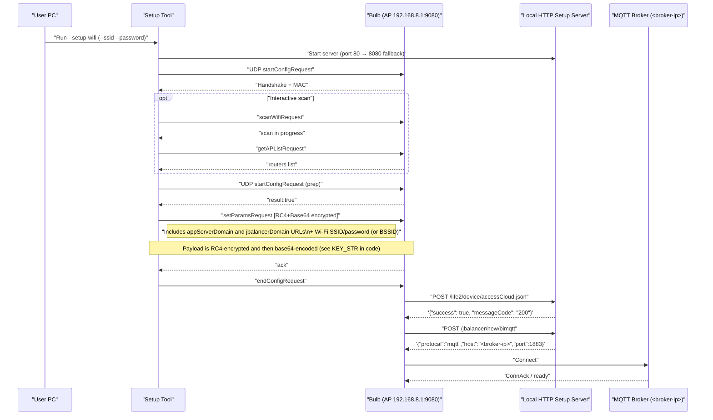

# Sengled WiFi Bulb Local Control / Setup Tool

A comprehensive tool for local control and protocol research of Sengled Wi‑Fi bulbs. It can pair bulbs to your own MQTT broker (no cloud), provides UDP control, and includes firmware flashing capability to install open source firmware like Tasmota since Sengled's cloud servers are no longer functional.

> [!IMPORTANT]
> The **flashing/jailbreaking process** is based on testing with **W31-N15 and W31-N11** bulbs, which use Sengled's WF863 module (based on ESP8266EX). **Other bulbs appear to use other modules** (like WF864, based on MX1290 chip), which may not work with the flashing process. The basic MQTT/UDP control should work with most Sengled bulbs. We're working on acquiring other bulbs to test/develop with them and will add to this list.
>
> Currently known working bulbs ✅
> * W31-N15 (WiFi multi-color LED) - WF863 Module / Espressif ESP8266EX chip
> * W31-N11 (WiFi multi-color LED) - WF863 Module 
>
> Currently known NON-working bulbs ❌
> * W12-N15 (WiFi white LED) - WF864 module / MXCHIP MX1290 chip
> * W21-N13 and W11-N13 (WiFi multi-color LED) - MXCHIP EMW3091 module / unknown chip
>
> Check the side of your bulb for FCC ID - it contains the ID of the module (or chip) used inside the bulb, matching one of the above. Post an issue if you find a bulb using a supported module that's not listed!

## Quick Usage

For a fuller, step‑by‑step guide, see [Instructions](INSTRUCTIONS.md).

The tool can perform Wi‑Fi pairing and basic UDP control. The HTTP server used during pairing is now embedded and auto‑managed by the tool.

### Install

* Python 3.10+ recommended
* Install dependencies:

```
pip install -r requirements.txt
```

### Wi‑Fi Pairing Steps

1. Start your MQTT broker (e.g., Mosquitto). See more information and examples in [INSTRUCTIONS.md](INSTRUCTIONS.md).

   * Windows example (run terminal as Administrator and ideally `cd` to the project root first):

     ```
      "C:\\Program Files\\mosquitto\\mosquitto.exe" -c .\\mosquitto.conf -v
     ```
2. Factory reset the bulb to enter AP mode.

   * Rapidly toggle power 5 times until it broadcasts `Sengled_Wi‑Fi_Bulb_...`.
3. Run the Wi‑Fi setup:

   * Interactive:

     ```
      # If --broker-ip is omitted, the tool uses this PC's local IP automatically
      python sengled_tool.py --setup-wifi
     ```
     Connect your computer to the bulb's AP: `Sengled_Wi‑Fi_Bulb_...` when prompted
   * Non‑interactive:

     Connect your computer to the bulb's AP: `Sengled_Wi‑Fi_Bulb_...` first.
     ```
      # If --broker-ip is omitted, the tool uses this PC's local IP automatically
      python sengled_tool.py --setup-wifi --ssid "YourSSID" --password "YourWifiPassword"
     ```
4. If the embedded HTTP server can't bind to 80/8080, stop whatever is on those ports or set `SENGLED_HTTP_PORT`.
5. The bulb will hit:

   * `POST/GET /life2/device/accessCloud.json`
   * `POST/GET /jbalancer/new/bimqtt`
     Then it connects to your MQTT broker.

What happens:

* The tool starts a local HTTP server automatically on port 80 (falls back to 8080 if needed; override with env `SENGLED_HTTP_PORT`).
* It performs the Wi‑Fi setup handshake with the bulb and sends config that points to your MQTT broker.
* It waits until the bulb hits both endpoints, then shuts down the HTTP server automatically:

  * `POST/GET /life2/device/accessCloud.json` (returns success JSON)
  * `POST/GET /jbalancer/new/bimqtt` (returns `{ protocal: "mqtt", host: <broker-ip>, port: 1883 }`)
* After that, it blinks the bulb via UDP (ON → 3s → OFF) as a quick success indicator.

## MQTT Control

Use these commands after the bulb is paired and connected to your broker. See [MQTT_COMMANDS_REFERENCE.md](MQTT_COMMANDS_REFERENCE.md) for complete details.

<details>
<summary>Basic Commands</summary>

```
# Turn on
python sengled_tool.py --broker-ip 192.168.0.100 --mac E8:DB:8A:AA:BB:CC --on

# Turn off
python sengled_tool.py --broker-ip 192.168.0.100 --mac E8:DB:8A:AA:BB:CC --off

# Set brightness (0-100)
python sengled_tool.py --broker-ip 192.168.0.100 --mac E8:DB:8A:AA:BB:CC --brightness 50

# Set color (R G B; 0-255 each)
python sengled_tool.py --broker-ip 192.168.0.100 --mac E8:DB:8A:AA:BB:CC --color 255 0 0

# Set color temperature (0-100% as 2700-6500K)
# Note: When changing color temperature, include a switch ON in the same payload (the app does this automatically).
python sengled_tool.py --broker-ip 192.168.0.100 --mac E8:DB:8A:AA:BB:CC --color-temp 65

# Query status
python sengled_tool.py --broker-ip 192.168.0.100 --mac E8:DB:8A:AA:BB:CC --status

# Factory reset
python sengled_tool.py --mac E8:DB:8A:AA:BB:CC --reset
```

</details>

<details>
<summary>Advanced Commands</summary>

```
# Custom payload (JSON array of command objects)
# Example: turn on via raw publish
python sengled_tool.py --broker-ip 192.168.0.100 --mac E8:DB:8A:AA:BB:CC \
  --custom-payload "[{\"dn\":\"E8:DB:8A:AA:BB:CC\",\"type\":\"switch\",\"value\":\"1\",\"time\":1690000000000}]"

# Custom publish (raw topic/payload)
python sengled_tool.py --broker-ip 192.168.0.100 --mac E8:DB:8A:AA:BB:CC \
  --topic wifielement/E8:DB:8A:AA:BB:CC/update \
  --payload "[{\"dn\":\"E8:DB:8A:AA:BB:CC\",\"type\":\"switch\",\"value\":\"1\",\"time\":1690000000000}]"

# Firmware upgrade (Sengled-Rescue path, flashes shim to let you run your own firmware)
# ⚠️ This is a one-way trip! The *.bin you flash *MUST* be compatible with ESP RTOS SDK bootloader, launching from an OTA
# partition (unpredictably either ota_0 or ota_1, so you don't know where it will land at the time of update).
# See sengled_ota/README.md for details.
# A working shim.bin is included - a compiled copy of Sengled-Rescue - that lets you flash any firmware.
python sengled_tool.py --broker-ip 192.168.0.100 --mac E8:DB:8A:AA:BB:CC \
  --upgrade shim.bin

# Group control (example: switch ON for a list of MACs)
python sengled_tool.py --broker-ip 192.168.0.100 \
  --group-macs E8:DB:8A:AA:BB:CC E8:DB:8A:11:22:33 \
  --group-switch on
```

</details>

## UDP Control

Direct local commands that don't require the MQTT broker or HTTP setup server once the bulb is paired and on your network. See [UDP_COMMANDS_REFERENCE.md](references/UDP_COMMANDS_REFERENCE.md) for complete details.

<details>
<summary>Basic UDP Commands</summary>

```
# Replace <bulb-ip> with the bulb's IP

# Turn on
python sengled_tool.py --ip <bulb-ip> --udp-on

# Turn off
python sengled_tool.py --ip <bulb-ip> --udp-off

# Set brightness (0-100)
python sengled_tool.py --ip <bulb-ip> --udp-brightness 50

# Set color (R G B; 0-255 each)
python sengled_tool.py --ip <bulb-ip> --udp-color 255 0 0
```

**Note:** There might be more UDP commands available. Check [UDP_COMMANDS_REFERENCE.md](UDP_COMMANDS_REFERENCE.md) for the complete list of documented commands.


</details>

## Troubleshooting

See the consolidated guide in Instructions: [INSTRUCTIONS.md — Troubleshooting](INSTRUCTIONS.md#troubleshooting).

## FAQ

<details>
<summary>How do I use this with Home Assistant?</summary>

**Yes, but only if custom firmware (like Tasmota) is used.** This repo does not include a Home Assistant integration, but it's possible to create one fairly easily using the documented MQTT topics and payloads. However, the MQTT broker will need to be running, or UDP commands will need to be used. **For easier usage, it's better to flash the firmware with Tasmota.**

</details>

<details>
<summary>Will this make my bulbs work with Google Home?</summary>

* If a bulb was already paired with Sengled cloud, it should continue to work with Google Home as before. You can still control it locally via UDP.
* Bulbs newly paired with this tool are redirected to your local broker and do not register with Sengled cloud; they will not work with the official Sengled Google Home integration.
* **However, if you use Home Assistant, you can integrate with Google Home through Home Assistant's Google Assistant integration.**

</details>

<details>
<summary>I don't use Home Assistant. Can I still control bulbs?</summary>

**Yes, with the documented MQTT and UDP commands.** For easier usage, it's recommended to use webhooks, automation scripts, or create a simple control interface. Options include: a small Android app, a simple script/service on a PC or server triggered by your phone (shortcuts/webhooks), or any automation that publishes the documented MQTT or UDP commands.

</details>

## Wi-Fi Setup Sequence

The following diagram shows the local AP-mode pairing flow: what the tool sends to the bulb, what the bulb fetches from your local HTTP server, and how it connects to your MQTT broker. This matches the actual behavior in `sengled_tool.py` and the documented endpoints.


