## Quick Navigation

- **[External Broker (Mosquitto)](#external-broker-mosquitto)**
- **[Embedded Broker & Servers](#embedded-broker--servers)**
- **[HTTP Server Options](#http-server-options)**
- **[Start Mosquitto](#start-mosquitto)**
- **[Subscribe to Topics](#subscribe-to-topics)**
- **[Certificates](#certificates)**
- **[OpenSSL Certificate Generation](#openssl-certificate-generation)**
- **[WiFi Pairing Reference](#wifi-pairing-reference-reverse-engineered)**
- **[Setup & Control Flow](#setup--control-flow)**

## External Broker (Mosquitto)

For advanced users/devs or custom solutions (not Home Assistant): you can use an external TLS MQTT broker instead of the embedded broker. Use `--broker-ip` and `--broker-port` to point bulbs at your broker.

TLS on port 8883 is mandatory. Certificates are generated automatically and stored here:

- Windows: `%USERPROFILE%\.sengled\certs\`
- Linux/macOS: `~/.sengled/certs/`

Regenerate at any time:

```bash
python sengled_tool.py --regen-certs
```

If you prefer manual generation with OpenSSL, see [CERTIFICATE_GENERATION.md](examples/CERTIFICATE_GENERATION.md).

Examples:

```bash
# Wi‑Fi setup targeting external broker
python sengled_tool.py --setup-wifi --ssid "YourSSID" --password "YourWifiPassword" --broker-ip 192.168.0.100 --broker-port 8883

# Control a bulb over external broker
python sengled_tool.py --broker-ip 192.168.0.100 --broker-port 8883 --mac E8:DB:8A:AA:BB:CC --on
```

Note: If `--broker-ip` is omitted during setup, the tool uses this PC's LAN IP by default.

## Embedded Broker & Servers

Run the embedded TLS broker and HTTP server together:

```bash
python sengled_tool.py --run-servers
```

### Regaining Control After Terminal Close

If you've completed Wi-Fi pairing but closed the terminal (or refused firmware flashing), you can regain control:

1. **Start the servers** to let the bulb reconnect:
```bash
python sengled_tool.py --run-servers
```

2. **Wait up to 30 seconds** for the bulb to reconnect to your broker

3. **Control the bulb** using MQTT commands:
```bash
# Reset the bulb
python sengled_tool.py --mac 40:43:18:74:C9 --reset

# Turn it on
python sengled_tool.py --mac 40:43:18:74:C9 --on

# Set brightness
python sengled_tool.py --mac 40:43:18:74:C9 --brightness 50
```

The bulb will automatically reconnect to your broker once the servers are running again.

## HTTP Server Options

- `--run-http-server` – run only the HTTP server
- `--http-port 8080` – HTTP port (default 8080)
- `--http-server-ip <ip>` – IP/host embedded in HTTP URLs returned to bulbs

## Start Mosquitto

The example config [mosquitto.conf](mosquitto.conf) is set up for TLS on 8883 and references the tool’s certs path. Run it from the `docs/examples` directory, or pass the absolute path.

Windows:

```bash
# From docs/examples directory
"C:\\Program Files\\mosquitto\\mosquitto.exe" -c "mosquitto.conf" -v

# Or with an absolute path to the config
"C:\\Program Files\\mosquitto\\mosquitto.exe" -c "%USERPROFILE%\\Desktop\\SengledTools\\docs\\examples\\mosquitto.conf" -v
```

Linux/macOS:

```bash
mosquitto -c mosquitto.conf -v
```

Notes:

- The sample config references Windows-style paths with `%USERPROFILE%`. On Linux/macOS, update paths to `~/.sengled/certs/` if needed.
- TLS is required; plaintext MQTT will not work with these bulbs.

## Subscribe to Topics

After the bulb connects to your broker, subscribe to all topics to inspect messages:

Windows:

```bash
"C:\\Program Files\\mosquitto\\mosquitto_sub.exe" -h 192.168.0.100 -p 8883 --cafile "%USERPROFILE%\\.sengled\\certs\\ca.crt" -v -t "#"
```

Linux/macOS:

```bash
mosquitto_sub -h 192.168.0.100 -p 8883 --cafile ~/.sengled/certs/ca.crt -v -t "#"
```

### Example Output

When you subscribe to all topics (`#`), you'll see messages like this from your bulb:

```
wifielement/c/status [{"dn":"40:43:18:2F:74:C9","type":"supportAttributes","value":"brightness","time":"49"}]
wifielement/40:43:18:2F:74:C9/status [{"dn":"40:43:18:2F:74:C9","type":"brightness","value":"0","time":"49"},{"dn":"40:43:18:2F:74:C9","type":"version","value":"V1.0.0.4","time":"49"},{"dn":"40:43:18:2F:74:C9","type":"switch","value":"0","time":"49"},{"dn":"40:43:18:2F:74:C9","type":"productCode","value":"wifielement","time":"49"},{"dn":"40:43:18:2F:74:C9","type":"typeCode","value":"W31-N11","time":"49"},{"dn":"40:43:18:2F:74:C9","type":"identifyNO","value":"ESP8266","time":"49"},{"dn":"40:43:18:2F:74:C9","type":"ip","value":"192.168.0.24","time":"49"},{"dn":"40:43:18:2F:74:C9","type":"deviceRssi","value":"-55","time":"49"},{"dn":"40:43:18:2F:74:C9","type":"saveFlag","value":"1","time":"49"}]
wifielement/40:43:18:2F:74:C9/status [{"dn":"40:43:18:2F:74:C9","type":"timeZone","value":"America/Chicago","time":"49"}]
wifielement/40:43:18:2F:74:C9/consumption [{"dn":"40:43:18:2F:74:C9","type":"consumption","value":"491","time":"49"}]
wifielement/40:43:18:2F:74:C9/consumptionTime [{"dn":"40:43:18:2F:74:C9","type":"consumptionTime","value":"21614","time":"49"}]
wifielement/40:43:18:2F:74:C9/status [{"dn":"40:43:18:2F:74:C9","type":"switch","value":"1","time":"50"}]
```

This shows the bulb's status, version, IP address, RSSI signal strength, and other diagnostic information.

## Certificates

- Windows: `%USERPROFILE%\.sengled\certs\{ca.crt, server.crt, server.key}`
- Linux/macOS: `~/.sengled/certs\{ca.crt, server.crt, server.key}`

These are the locations where the script automatically saves generated certificates.

Regenerate at any time:

```bash
python sengled_tool.py --regen-certs
```

If you insist on custom certs, generate them with OpenSSL and update `mosquitto.conf` accordingly.

### OpenSSL Certificate Generation

See [CERTIFICATE_GENERATION.md](CERTIFICATE_GENERATION.md) for Windows and Linux commands.

## WiFi Pairing Reference (Reverse Engineered)

The Wi-Fi pairing process involves a complex sequence of UDP commands and HTTP requests that we've reverse-engineered. Here's what happens under the hood:

### Pairing Sequence

1. **UDP Handshake**: The tool sends `startConfigRequest` to the bulb (192.168.8.1:9080)
2. **WiFi Scan**: Optional network scanning via `scanWifiRequest` and `getAPListRequest`
3. **Configuration**: Encrypted parameters sent via `setParamsRequest` (RC4 + Base64)
4. **HTTP Setup**: Bulb connects to local server for cloud access simulation
5. **MQTT Connection**: Bulb receives broker details and establishes connection

### Technical Details

- **Encryption**: All sensitive data uses RC4 encryption with `KEY_STR` constant
- **Ports**: HTTP server starts on port 80, falls back to 8080; MQTT uses 8883 (TLS)
- **Endpoints**: Bulb expects specific JSON responses from `/life2/device/accessCloud.json` and `/jbalancer/new/bimqtt`

For complete technical documentation, see [WIFI_PAIRING_REFERENCE.md](docs/references/WIFI_PAIRING_REFERENCE.md).


## Setup & Control Flow

```mermaid
graph TD
    subgraph "Phase 1: One-Time Setup (Do this once per bulb)"
        A["👤 1. Run the Easy Setup Wizard (starts embedded TLS broker on 8883)"] --> B["👤 2. Factory Reset Bulb<br>(Flick power switch rapidly 5+ times)"];
        B --> C["👤 3. Run the Wi-Fi Setup Wizard<br><code>python sengled_tool.py --setup-wifi</code>"];
        
        C -- "This automatically starts a..." --> D{{"💻 Temporary Web Server<br><i>(Mimics Sengled's online server)</i>"}};
        
        E["💡 Bulb (in setup mode)"] -- "Connects to your PC, expecting<br>to find Sengled's cloud server" --> D;
        D -- "Tells the bulb to use the<br>embedded MQTT Broker instead" --> E;
        
        E -- "Connects to your Wi-Fi,<br>then the embedded Broker!" --> F[("📡 Embedded MQTT Broker (Port 8883)")];
        F --> G["✅ Setup Complete! The bulb is now on your local network."];
    end

    subgraph "Phase 2: Everyday Control (Use these commands anytime)"
        G --> H{"Choose your control method"};
        
        H -- "Control via Embedded Broker (MQTT)" --> I["⌨️ 👤 Send command via Broker<br><code>--mac ... --on</code>"];
        I -- "Command goes to Embedded Broker" --> J[("📡 Embedded MQTT Broker")];
        J -- "Broker relays command to bulb" --> K((💡 Bulb Receives Command & Responds));

        H -- "Direct Control (UDP)" --> M["⌨️ 👤 Send command directly<br><code>--ip ... --udp-on</code>"];
        M -- "Command goes straight<br>to the bulb over Wi-Fi" --> K;
    end

    %% --- STYLES ---
    style A fill:#e8f5e9,stroke:#388e3c,stroke-width:2px
    style B fill:#e8f5e9,stroke:#388e3c,stroke-width:2px
    style C fill:#e8f5e9,stroke:#388e3c,stroke-width:2px
    style I fill:#e8f5e9,stroke:#388e3c,stroke-width:2px
    style M fill:#e8f5e9,stroke:#388e3c,stroke-width:2px
    
    style D fill:#e1f5fe,stroke:#0288d1,stroke-width:2px

    style E fill:#fff9c4,stroke:#fbc02d,stroke-width:2px
    style K fill:#fff9c4,stroke:#fbc02d,stroke-width:2px

    style F fill:#fce4ec,stroke:#c2185b,stroke-width:2px
    style J fill:#fce4ec,stroke:#c2185b,stroke-width:2px

    style G fill:#d1c4e9,stroke:#512da8,stroke-width:2px
```


