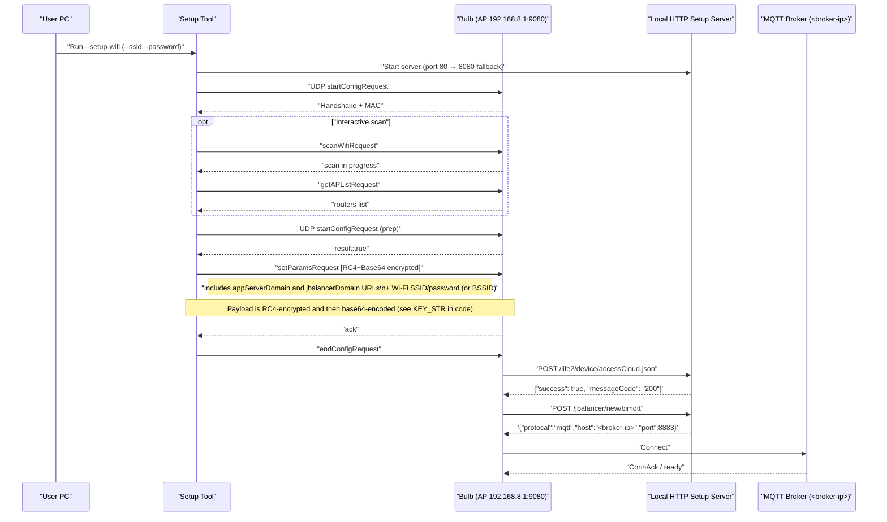

# Wi-Fi Pairing Reference

This document details the local AP-mode pairing flow for Sengled bulbs, showing the exact sequence of commands and responses between the setup tool, bulb, HTTP server, and MQTT broker.

## Pairing Sequence Diagram

## Key Details

- **Encryption**: All sensitive data (Wi-Fi credentials, server URLs) is RC4-encrypted with `KEY_STR` and then base64-encoded
- **HTTP Endpoints**: The bulb expects specific JSON responses from `/life2/device/accessCloud.json` and `/jbalancer/new/bimqtt`
- **Port Fallback**: HTTP server starts on port 80, falls back to 8080 if needed
- **MQTT Port**: Default MQTT broker connection uses port 8883 (TLS)
